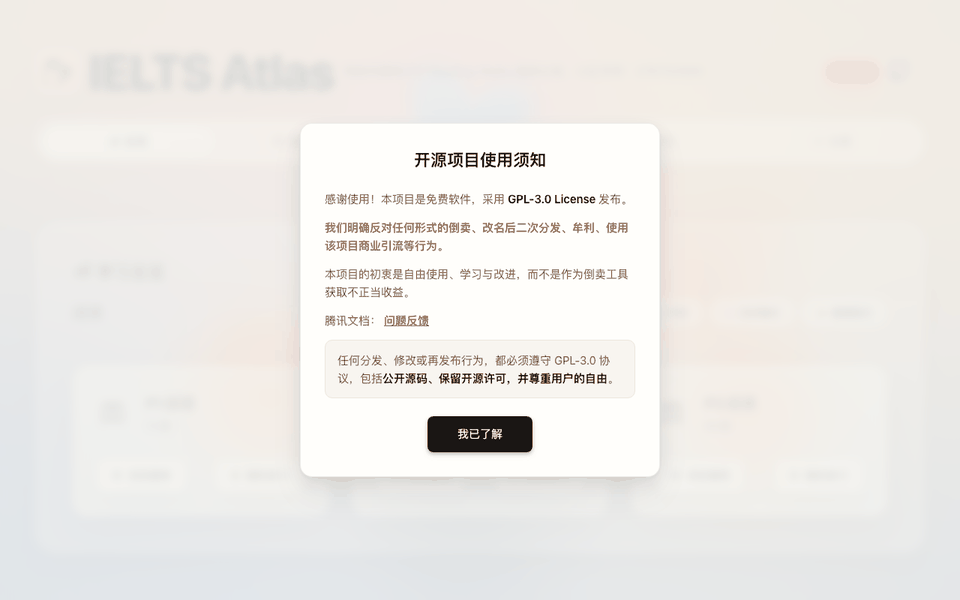
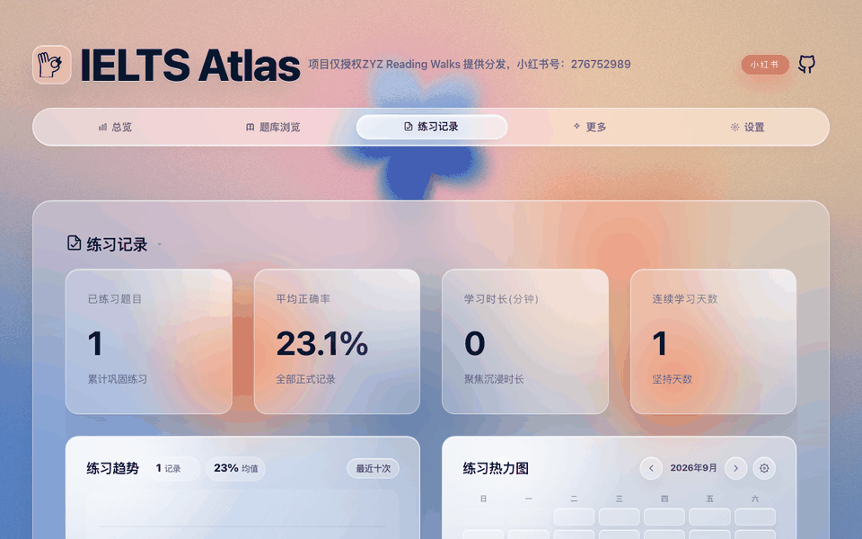

# IELTS Atlas / IELTS Practice

**English** | [简体中文](README.zh-CN.md)

[v0.6.3.1 Release Notes](RELEASE_NOTE-0.6.3.1.md)

[](https://deepwiki.com/sallowayma-git/IELTS-practice)

## Important Usage Notice

This project may be run locally, self-hosted, or deployed in a personally controlled web environment for learning, research, and personal use. You may deploy it on your own computer, private server, NAS, or personal web space, provided you keep access and distribution under control.

Do not publicly redistribute websites, mirror sites, or archives that contain question sources, audio, PDFs, explanations, modified pages, or packaged builds. Do not use this project for commercial sales, paid communities, traffic generation, promotion, or any other for-profit activity. The question sources and some materials carry third-party copyright risk, and publicly hosting exam-style web pages may also harm the interests of practitioners in this field. Large-scale distribution significantly increases the risk of complaints, takedown reports, repository deletion, or page closure, ultimately affecting all users.

To keep this project available long-term, please follow these principles: **self-host, use personally, control distribution, and never profit from the project or its question sources.**

Code licensing is governed by [LICENSE](LICENSE). Question sources, articles, audio, PDFs, images, and other third-party content remain the property of their original copyright holders, and are recommended for personal study and exam preparation only.

## Branch Overview

This project currently maintains three main branches, each targeting different use cases and technical needs:

| Branch | Description | Status | Maturity | Tech |
|------|------|--------|----------|------|
| [main](https://github.com/sallowayma-git/IELTS-practice/tree/main) | Static web edition (this branch), pure frontend, runs on almost any device |  |  |  |
| [feature/multi-device-easy-deploy](https://github.com/sallowayma-git/IELTS-practice/tree/feature/multi-device-easy-deploy) | Self-hosted server edition with multi-device data sync, for users with some technical background |  |  |  |
| [IELTS-WRITING-FEAT](https://github.com/sallowayma-git/IELTS-practice/tree/IELTS-WRITING-FEAT) | AI-native collaboration client with AI-powered writing scoring, reading coaching, self-evolution, and more |  |  |  |

| Related Repository | Description | Status | Tech |
|:--------:|------|------|----------|
| [IELTS-&#8288;Project (IELTMPS)](https://github.com/k-undurkhaan-2/IELTS-Project) | Integrated solution for a standalone web server, covering a complete backend, routing, database, and security infrastructure |  |  |

## Project Overview

IELTS Atlas is a pure-frontend practice system focused on IELTS reading, with an optional local listening extension. The single entry point is `index.html`; the app runs on static HTML, CSS, JavaScript bundles, and local question-bank assets, with no backend service required.

The system provides question-bank browsing, reading practice, optional listening practice, test-set practice, practice records, score statistics, mistake analysis, data backup, question-bank import, vocabulary tools, reading review, and achievements. Data is stored in browser-local storage by default; the app runs directly over `file://` and can also be deployed to static web hosting.

## Quick Start



**Requirements:** a recent stable version of Chrome or Edge. Allow pop-ups when prompted — practice pages open in a new window.

**Run locally:**

1. Download and extract the full project. Keep the directory structure intact — do not copy `index.html` alone.
2. Open `index.html` in your browser.
3. Go to **Library (题库浏览)** and confirm the question list loads.
4. If the browser blocks a pop-up when you start a practice, allow it and try again.

`index.html` is the only entry point; older entry pages mentioned in legacy docs are no longer valid. If your browser restricts `file://` resources, serve the project root instead:

```bash
python -m http.server 8000   # then open http://localhost:8000/
```

**Static hosting:** the runtime files can be deployed to static web hosting for personal or small-scale use. Keep the full directory hierarchy to avoid 404s for bundles, question banks, fonts, images, PDFs, audio, and generated assets. Re-read the usage notice above before any public deployment — a page that can be deployed is not a license to distribute it.

## Features

### Learning Overview

The overview page summarizes your practice state from local records: items practiced, average performance, study time, streaks, and per-category progress. Use it as your daily entry point to decide what comes next — more practice, mistake review, or vocabulary.

### Question Bank

The library is the core entry of the system. Reading resources are supported by default; listening resources attach as an optional local extension.

- Filter by type (All / Reading / Listening) and by category (P1, P2, P3); search by title, filename, or metadata; sort and view practice status and progress.
- Import custom question banks from a folder via **Settings → Load question bank**, switch between bank configurations, or force-refresh the index from Settings.

The default reading index is generated under `assets/generated/` and should not be hand-edited. Listening indexes are produced by the browser-side scan when you import your own resources.

### Reading Practice

Reading practice runs in the unified reading page, built on generated assets:

```text
assets/generated/reading-exams/
assets/generated/reading-explanations/
```

- Open a practice from a library card; answer, submit, and view results in the unified page.
- Explanations, passage highlighting, and answer comparison are built in; completed results sync automatically into practice records.
- The same page also powers **reading review (背题)** mode for studying answers and explanations.

If a practice opens but the score is not saved, check pop-up permissions, console errors, and cross-window messaging (see FAQ).

### Listening Practice

Listening practice connects through a listening index and the record bridge. For copyright compliance, the public repository and standard release packages do not include listening audio, question sources, PDFs, the full `ListeningPractice/` directory, or pre-generated listening indexes.

To enable listening locally, prepare your own resources and place the generated index at:

```text
assets/generated/listening-exams/manifest.js
assets/generated/listening-exams/listening-index.compat.js
```

It supports importing self-prepared listening resources, the P1–P4 structure, and unifying listening results into the same record and statistics pipeline as reading via `listening-record-bridge`. Missing files in a public package are expected, not a defect. To include your own `ListeningPractice/P1–P4` in a personal-use package, build with `INCLUDE_LOCAL_LISTENING=1` (see Build & Release).

### Test-Set Mode

Test-set mode chains several practice units into one session and aggregates the results — useful for simulating a full run without manual jumps between items.

- Creates a test-set session and opens items in order, tracking the current window and item.
- Aggregates scores, durations, and results into a single test-set record, and keeps completed results when the session is interrupted.
- Cleans up sub-records so the history list does not show duplicates.

This mode relies on stricter window management; if pop-ups are blocked or a window is closed manually, the system falls back to a degraded save path.

### Practice Records & Statistics

The records page views, filters, exports, and manages history from reading, listening, test sets, and degraded saves:

- Stat cards (items practiced, average accuracy, study time), trend analysis with time ranges, a practice heatmap, priority-bank progress, and a reading mistake radar.
- A history list filterable by All / Reading / Listening, with batch selection and deletion, Markdown export, and per-record details (score, duration, answer comparison, raw results).

Practice records are the core user data of this system. Clearing cache, switching browsers, private mode, or automatic site-data cleanup can all affect persistence — export or back up your data regularly from Settings.

### Settings & Data Management

Settings centralizes system, question-bank, and data management:

- **System:** clear all local data (restores first-run; external JSON backups are kept), load question banks, switch themes, switch bank configurations, force-refresh the bank index.
- **Data:** create backups and restore from the backup list, export/import data as JSON for migration and long-term storage, with basic integrity checks on import.

Core data persists in IndexedDB; if it is unavailable the app reports an error explicitly rather than silently degrading records. localStorage only handles legacy migration and a few compatibility states, and sessionStorage holds session drafts. Data is isolated per browser, protocol, and origin.

### Errors & Diagnostics

Open **Settings → Errors and diagnostics (错误与诊断)** to look up failures by incident ID, export a local JSON report, or copy a summary. Reports are sanitized and exclude answers; they do not replace learning-data backups. Exporting a report does not resubmit practice or run active diagnostics. If clipboard access or downloads are unavailable, select the diagnostic text on the page. If a practice window disconnects from the main page, export from that window; the report identifies incomplete cross-window coverage.

Diagnostic history retains at most 7 days, 2,000 events, or about 2 MiB, whichever limit is reached first. You can clear diagnostics separately, disable persistence, retry diagnostic storage, or enable detailed diagnostics for 15 minutes. With persistence disabled, short-lived page context remains available for immediate notifications and exports. Clearing all site data also clears learning data.

Capture cannot be guaranteed when JavaScript is disabled, the page is closed, the browser crashes, the main thread is fully blocked, or cross-origin error details are inaccessible. See the [diagnostic acceptance guide](developer/docs/diagnostic-acceptance.md) for hosting modes, verified scenarios, and release qualification.

### More Tools & Themes

- **Vocabulary practice** with built-in word lists and spaced review.
- **Reading review** to study answers, explanations, and highlights in the unified page.
- **Achievements** unlocked by practice and usage behavior.
- The main UI is HeroUI-styled with dynamic backgrounds and dedicated panels for library, records, settings, and tools. Themes change visuals only — never records, indexes, or storage formats. Theme logic lives in `js/plugins/themes/` and `js/presentation/`.

## Usage Guide

The demos below were captured from a live session with real data.

### Run a practice


As shown: locate an item in **Library (题库浏览)** and click its practice button, complete and submit in the new window — explanations, passage highlighting, and answer comparison appear immediately, and the result lands in **Practice Records (练习记录)**.

If nothing opens, allow pop-ups; if nothing saves, check the console for resource or messaging errors (see FAQ).

### Use test-set mode

1. Pick a test set from the library and complete each item in order.
2. The session aggregates all sub-results into one test-set record, visible in Practice Records.

Avoid running the same set in parallel windows — it complicates window tracking and record merging.

### View and export records



Stat cards, trends, the heatmap, and the history list are shown above; filter by All / Reading / Listening, open a record for details, export a Markdown report, or batch-delete records.

Export or back up before deleting — recovery depends on available backups.

### Import a custom question bank

1. Go to **Settings (系统设置) → Load question bank**, choose a reading or listening directory, then run a full or incremental import.
2. Verify the list in Library; switch between configurations via **Bank configuration** if you have several.

Keep custom bank directories stable — moving files or renaming folders can break the match between records and bank items.

### Back up, restore, migrate

1. **Settings → Create backup** saves a local snapshot; **Export data** produces a portable file; **Import data** restores it in a new environment.
2. After importing, verify records, stat cards, and the bank list.

Local storage is bound to the browser, protocol, and origin — data opened via `file://` and data served from `http://localhost:8000/` do not necessarily share.

## Project Structure

Runtime files:

```text
index.html
css/
js/bundles/
assets/
ReadingPractice/
```

Key source directories:

```text
js/app/            App entry, state bridge, library browsing, sessions, test sets
js/core/           Practice, records, storage, vocabulary
js/data/           Repositories and data sources
js/runtime/        Lazy loading, startup screen, unified reading runtime
js/services/       Bank discovery and management, statistics, achievements
js/components/     Settings, diagnostics, record dialogs, bank status UI
js/presentation/   Navigation, themes, More Tools, home interactions
js/utils/          Storage, answer matching, import/export, DOM helpers
js/plugins/        Themes and extension bridges
assets/generated/  Generated reading bank pages and explanations; optional listening index
developer/         Docs, tests, and build/release scripts
```

Release packages should contain only the files users need at runtime — no source directories, dev docs, test tooling, or `node_modules/`.

## Build & Release

`index.html` loads prebuilt `js/bundles/*.bundle.js`. After editing any source file, rebuild the bundles — never edit them by hand:

```bash
node scripts/build-bundles.mjs
```

Create a release package (the script rebuilds bundles first, then packs the runtime files into a zip that opens via `index.html` after extraction):

```bash
# Linux / Git Bash
bash developer/release.sh 0.6.2-fix
# Windows PowerShell
powershell -ExecutionPolicy Bypass -File developer/release.ps1 0.6.2-fix
```

Output: `dist/ielts-practice-{version}.zip`.

Standard packages exclude your local `ListeningPractice/` directory and listening assets. To bundle self-prepared listening resources into a personal-use package, first make sure `assets/generated/listening-exams/manifest.js` and `listening-index.compat.js` exist, then build with:

```bash
INCLUDE_LOCAL_LISTENING=1 bash developer/release.sh 0.6.2-fix
# PowerShell: set $env:INCLUDE_LOCAL_LISTENING = "1" before running release.ps1
```

The script then includes whichever of `ListeningPractice/P1` through `P4` exist locally.

## Testing

After functional or optimization changes, run in order:

```bash
python developer/tests/ci/run_static_suite.py    # writes developer/tests/e2e/reports/static-ci-report.json
python developer/tests/e2e/full_reset_flow.py
python developer/tests/e2e/suite_practice_flow.py
```

These are mandatory after changes to runtime code, bank indexes, asset paths, practice records, test-set flow, or release scripts. Documentation-only changes may skip the browser flows, but should still verify that referenced paths and commands exist. New QA, test, or verification scripts belong under `developer/tests/` so release packages stay clean.

## Technical Notes

- **Startup:** `index.html` loads the core bundles (`runtime-entry`, `core-foundation`, `ui-shell`, `legacy-app`), initializes storage namespaces and the app instance, loads bank indexes and records, then lazy-loads feature bundles (library, records, test sets, settings, tools) on demand.
- **Data storage:** IndexedDB holds all core persistent data (records, vocabulary, settings, bank configs, backups) with transactions and revision conflict detection; localStorage is legacy migration only; sessionStorage holds session drafts. Data is isolated per browser, protocol, and origin — migrate via export/import, never by copying internal storage.
- **Practice messaging:** practice windows talk to the main window via `postMessage`. The main window opens the practice page and session, the page loads its enhancer/bridge scripts, the user submits, and the main window normalizes the score and saves the record. Relevant bundles: `practice-page-enhancer`, `listening-record-bridge`, `session`, `practice`.
- **Bank assets:** generated reading assets live in `assets/generated/reading-exams/` and `assets/generated/reading-explanations/`, with the optional listening extension in `assets/generated/listening-exams/`. The public repo may not ship listening assets; runtime bank counts come from the manifests and the active configuration — this document intentionally does not state fixed counts.

## FAQ

### Styles broken or features missing after opening the page

Usually an incomplete directory or wrong asset path. Verify that `css/`, `js/bundles/`, `assets/`, and `ReadingPractice/` exist with relative paths intact, and extract release packages fully. Never run `index.html` alone from another directory.

### Clicking a practice opens no window

The practice page needs a new window or tab. Allow pop-ups for the site, click the entry again, and check DevTools Console for errors and 404s on the practice resource.

### No record saved after completing a practice

Typical causes: blocked cross-window messaging, failed resource loading, private-mode storage restrictions, disabled or quota-exhausted IndexedDB, or viewing data under a different protocol or origin. Check the console for `postMessage`, storage, or loading errors, export data in Settings to confirm what exists, retest on recent Chrome or Edge, or serve via a local static server.

### The question bank list is empty

Check that `assets/generated/reading-exams/manifest.js` and `reading-practice-unified.html` exist, that `js/bundles/core-foundation.bundle.js` loads, and that the `assets/` directory was not moved or pruned. For custom banks, re-import via **Settings → Load question bank**.

### The listening bank is invisible

This is expected in the public repo and standard packages — listening resources are not included. To enable listening locally, prepare your own resources and the two index files under `assets/generated/listening-exams/` (see Listening Practice), and build with `INCLUDE_LOCAL_LISTENING=1` to ship `ListeningPractice/P1–P4`.

### Data lost or statistics reset to zero

Local data can become invisible after cache clearing, private mode, or a protocol/origin change. Use the same browser, path, protocol, and origin as before, check the backup list in Settings, and import earlier exports. Export regularly for long-term safety.

### `file://` behaves differently from a local server

This is a normal consequence of browser security policy. The project aims to stay `file://`-compatible, but browsers may restrict audio, PDF, new windows, cross-page scripts, or local file access. Verify on Chrome or Edge first, then use a local static server to isolate the difference.

## License & Content Copyright

Code licensing is governed by [LICENSE](LICENSE). Follow its terms when using, modifying, or redistributing the code.

Question sources, articles, audio, PDFs, images, and explanations may come from third parties or original exam materials and remain copyrighted by their original owners. This project grants no commercial-use or public-redistribution rights over them. Users bear any legal and platform risks arising from copying, deploying, distributing, or commercializing such content.

## Star History

<a href="https://www.star-history.com/?repos=sallowayma-git%2Fielts-practice&type=date&logscale=&legend=top-left">
 <picture>
   <source media="(prefers-color-scheme: dark)" srcset="https://api.star-history.com/chart?repos=sallowayma-git/ielts-practice&type=date&theme=dark&legend=top-left" />
   <source media="(prefers-color-scheme: light)" srcset="https://api.star-history.com/chart?repos=sallowayma-git/ielts-practice&type=date&legend=top-left" />
   
 </picture>
</a>
